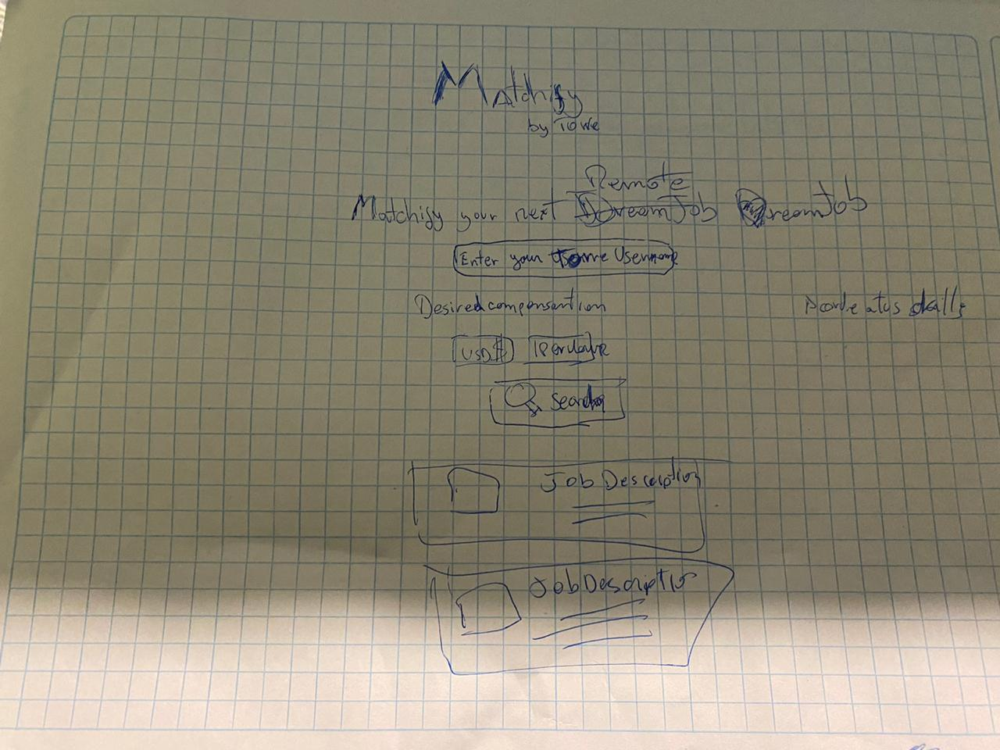
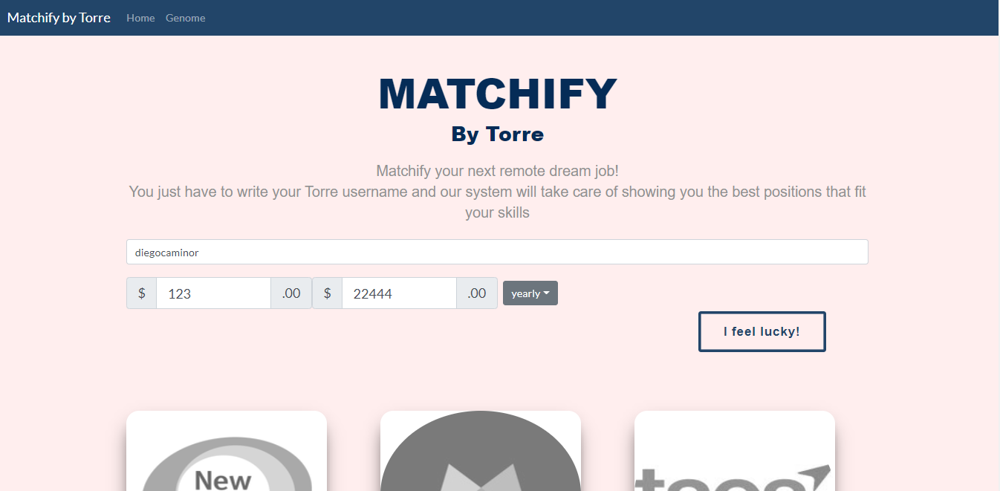

# :ledger: torre-technical-test-client

Client side for Torre technical test

### **Server side:** https://github.com/diegocaminor/torre-technical-test-server
### **Client side:** https://github.com/diegocaminor/torre-technical-test-client

### 🛠️ Technologies

- [**Node**](https://nodejs.org/en/)
- [**Vuejs**](https://vuejs.org/)
- [**Axios**](https://github.com/axios/axios)
- [**BootstrapVue**](https://bootstrap-vue.org/)


### 📷 Screenshots



## Project setup
```
npm install
```

### Compiles and hot-reloads for development
```
npm run serve
```

### Compiles and minifies for production
```
npm run build
```

### Lints and fixes files
```
npm run lint
```

### Customize configuration
See [Configuration Reference](https://cli.vuejs.org/config/).
